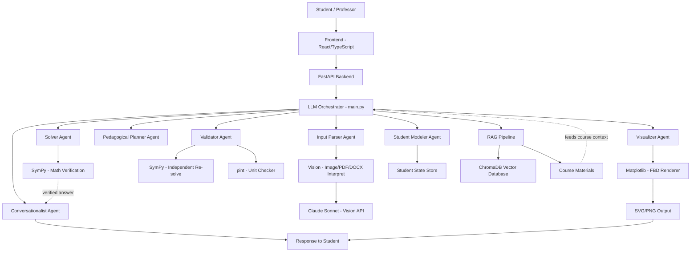

# Classroom-LM
AI-powered classroom assistant with student grouping, LLM tutoring, and math verification, freeform equations and engineering understanding.

## AI Pipeline Architecture



## Getting Started

### Prerequisites
- Python 3.9+
- Node.js v20 (use nvm)
- An Anthropic API key (get one at console.anthropic.com)

### 1. Clone the repo

```bash
git clone https://github.com/diegomartfue/Classroom-LM.git
cd Classroom-LM
```

### 2. Backend setup

```bash
cd backend
pip install -r requirements.txt
```

Create a .env file with your API key (do NOT commit this file):

```bash
cat > .env << 'EOF'
ANTHROPIC_API_KEY=your_key_here
EOF
```

Start the backend:

```bash
uvicorn main:app
```

The backend runs at http://localhost:8000. Verify with:

```bash
curl http://localhost:8000/health
```

### 3. Frontend setup

```bash
cd frontend
nvm use 20
npm install --legacy-peer-deps
npm run dev
```

The app runs at http://localhost:5173.

### 4. Test the pipeline
Send a test message to the 7-agent /tutor endpoint:

```bash
curl -X POST http://localhost:8000/tutor \
  -H "Content-Type: application/json" \
  -d '{"message": "A 4m beam is pinned at A and has a roller at B. A 500N downward force acts at the midpoint. Find the reactions.", "conversation_history": [], "student_model": {}}'
```

### Notes
- The .env file is gitignored — never commit your API key
- node_modules_old/ can be safely deleted if present
- If npm install hangs, try: mv node_modules node_modules_old && npm install --legacy-peer-deps

## Agent Architecture

| Agent | Model | Temp | Primary Role |
|-------|-------|------|--------------|
| Router | claude-haiku-4-5-20251001 | 0 | Classify each message into a route (PROBLEM/DRAW/CREATE/CONCEPT/SMALLTALK/OUT_OF_SCOPE) |
| Input Parser | claude-haiku-4-5-20251001 | 0 | Extract structured problem data from text |
| Direct Tutor | claude-sonnet-4-6 | 0.5 | Handle non-problem messages (concepts, small talk, out-of-scope) |
| Creator | claude-opus-4-7 | 0.4 | Generate practice problems and easier/harder variants |
| Student Modeler | claude-sonnet-4-6 | 0.2 | Maintain student strengths/weaknesses model |
| Pedagogical Planner | claude-opus-4-7 | 0.1 | Decide next action: solve, hint, ask, wait, clarify |
| Solver | claude-sonnet-4-6 | 0 | Generate symbolic/numerical solution |
| Validator | claude-sonnet-4-6 | 0 | Verify solver output via independent checks |
| Visualizer | claude-opus-4-7 | 0 | Produce structured FBD spec for the renderer |
| Schematic Layout | claude-sonnet-4-6 | 0.2 | Lay out an approximate schematic for multi-body setups (FBD fallback) |
| Diagram Renderer | claude-sonnet-4-6 | 0 | Generate matplotlib diagram code (streaming path) |
| Conversationalist | claude-sonnet-4-6 | 0.5 | Student-facing dialogue voice |

## Tech Stack
- **Frontend**: React, TypeScript, Vite
- **Backend**: FastAPI (Python)
- **AI**: Anthropic Claude API (primary)
- **Math**: SymPy (verification), pint (units)
- **Vector DB**: ChromaDB
- **Diagrams**: Matplotlib → SVG/PNG

## MVP Scope
2D rigid body statics and dynamics (particles and rigid bodies):
- Single rigid body in planar equilibrium (statics)
- 2D dynamics of particles and rigid bodies (ΣF=ma, ΣM=Iα, general plane motion)
- Standard supports: pin, roller, fixed, cable, contact
- Applied loads: point forces, point moments, distributed loads
- Input: text description (v1), image input (v2 - implemented)
