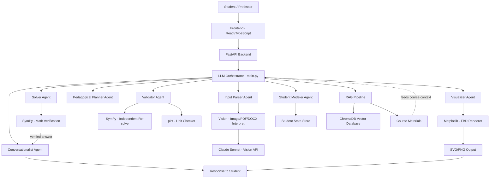

# Classroom-LM
AI-powered classroom assistant with student grouping, LLM tutoring, and math verification, freeform equations and engineering understanding.

## AI Pipeline Architecture

## Agent Architecture

| Agent | Model | Temp | Primary Role |
|-------|-------|------|--------------|
| Conversationalist | claude-sonnet-4-5 | 0.5 | Student-facing dialogue hub |
| Input Parser | claude-haiku-4-5 (text) / claude-sonnet-4-5 (image) | 0 | Extract structured problem data |
| Student Modeler | claude-sonnet-4-5 | 0.2 | Maintain student strengths/weaknesses model |
| Pedagogical Planner | claude-sonnet-4-5 | 0.1 | Decide next action: solve, hint, ask, wait |
| Solver | claude-sonnet-4-5 | 0 | Generate symbolic/numerical solution |
| Validator | claude-sonnet-4-5 | 0 | Verify solver output via independent checks |
| Visualizer | claude-sonnet-4-5 | 0.2 | Generate FBD diagram code |

## Tech Stack
- **Frontend**: React, TypeScript, Vite
- **Backend**: FastAPI (Python)
- **AI**: Anthropic Claude API (primary)
- **Math**: SymPy (verification), pint (units)
- **Vector DB**: ChromaDB
- **Diagrams**: Matplotlib → SVG/PNG

## MVP Scope
2D rigid body statics only:
- Single rigid body in planar equilibrium
- Standard supports: pin, roller, fixed, cable, contact
- Applied loads: point forces, point moments, distributed loads
- Input: text description (v1), image input (v2 - implemented)
