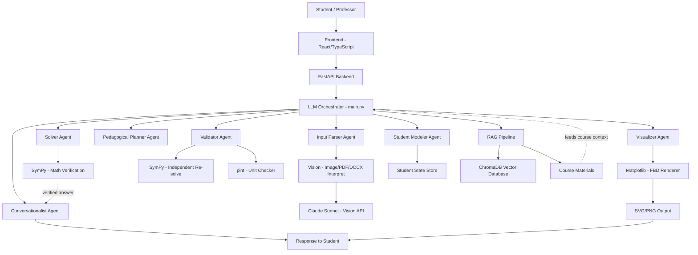

# Classroom-LM
AI-powered classroom assistant with student grouping, LLM tutoring, and math verification, freeform equations and engineering understanding.

## AI Pipeline Architecture


```mermaid
flowchart TD
    A[Student / Professor] --> B[Frontend - React/TypeScript]
    B --> C[FastAPI Backend]
    C --> D[LLM Orchestrator - main.py]

    D --> E[Conversationalist Agent]
    D --> F[Input Parser Agent]
    D --> G[Student Modeler Agent]
    D --> H[Pedagogical Planner Agent]
    D --> I[Solver Agent]
    D --> J[Validator Agent]
    D --> K[Visualizer Agent]

    F --> F1[Vision - Image/PDF/DOCX Interpret]
    F1 --> F2[Claude Sonnet - Vision API]

    I --> I1[SymPy - Math Verification]
    I1 -.->|verified answer| E

    J --> J1[SymPy - Independent Re-solve]
    J --> J2[pint - Unit Checker]

    K --> K1[Matplotlib - FBD Renderer]
    K1 --> K2[SVG/PNG Output]

    G --> G1[Student State Store]

    E --> L[Response to Student]
    K2 --> L

    D --> M[RAG Pipeline]
    M --> N[ChromaDB Vector Database]
    M --> O[Course Materials]
    O -.->|feeds course context| D
```

## Getting Started

### Prerequisites
- Python 3.9+
- Node.js v20 (use nvm)
- An Anthropic API key (get one at console.anthropic.com)

### 1. Clone the repo

```bash
git clone https://github.com/diegomartfue/Classroom-LM.git
cd Classroom-LM
```

### 2. Backend setup

```bash
cd backend
pip install -r requirements.txt
```

Create a .env file with your API key (do NOT commit this file):

```bash
cat > .env << 'EOF'
ANTHROPIC_API_KEY=your_key_here
EOF
```

Add at least one participant code. The server rejects every request
without an allowed code, so with an empty list nobody can use the tutor:

```bash
cp participants.example.txt participants.txt   # then edit: one code per line
# or: export PILOT_PARTICIPANT_CODES="P01-K7QX,P02-M3TD"
```

Start the backend:

```bash
uvicorn main:app
```

The backend runs at http://localhost:8000. Verify with:

```bash
curl http://localhost:8000/health
```

### 3. Frontend setup

```bash
cd frontend
nvm use 20
npm install --legacy-peer-deps
npm run dev
```

The app runs at http://localhost:5173.

### 4. Test the pipeline
Send a test message to the 7-agent /tutor endpoint:

```bash
curl -X POST http://localhost:8000/tutor \
  -H "Content-Type: application/json" \
  -H "X-Participant-Code: P01-K7QX" \
  -d '{"message": "A 4m beam is pinned at A and has a roller at B. A 500N downward force acts at the midpoint. Find the reactions.", "conversation_history": [], "student_model": {}}'
```

### Pilot configuration (backend environment variables)

| Variable | Default | Purpose |
|---|---|---|
| `PILOT_PARTICIPANT_CODES` | empty | Comma-separated allowed codes |
| `PILOT_PARTICIPANTS_FILE` | `backend/participants.txt` | File of allowed codes, one per line. Read on every request, so you can add codes without a restart. |
| `PILOT_PROFESSOR_CODES` | empty | Comma-separated professor codes (see "Uploads and privacy") |
| `PILOT_PROFESSORS_FILE` | `backend/professors.txt` | File of professor codes, one per line |
| `CORS_ALLOWED_ORIGINS` | `http://localhost:5173,http://localhost:3000` | Comma-separated frontend URLs allowed to call the API. Add the deployed frontend's URL, e.g. `https://tutor.example.edu` |
| `DAILY_COST_LIMIT_USD` | `20` | The tutor stops making API calls for the day once this is spent |
| `MOCK_TUTOR_STREAM` | off | **Dev only.** Set to `1` and `/tutor/stream` sends a canned reply (with math) in irregular bursts instead of running the agents. No API calls. Use it to check streaming in the browser. Never set it in production. |

Students sign in with only their participant code. The server saves every
record under that code and nothing else: no names, no emails.

### Notes
- The .env file is gitignored — never commit your API key
- node_modules_old/ can be safely deleted if present
- If npm install hangs, try: mv node_modules node_modules_old && npm install --legacy-peer-deps

## Deployment

### Streaming behind a reverse proxy

`/tutor/stream` sends the reply as server-sent events. A reverse proxy such as
nginx buffers responses by default. It then delivers the whole reply as one
chunk at the end, and the tutor looks frozen and then dumps everything at once.

The backend sends `X-Accel-Buffering: no` and `Cache-Control: no-cache,
no-transform` on every stream response. nginx honors the first header on its
own, so no config change is needed. If your proxy ignores these headers, or you
want to be explicit, turn off buffering and compression for the stream path:

```nginx
location /tutor/stream {
    proxy_pass http://127.0.0.1:8000;
    proxy_http_version 1.1;
    proxy_buffering off;
    proxy_cache off;
    gzip off;
    proxy_read_timeout 300s;   # long tutor turns shouldn't be cut off
}
```

Other proxies and CDNs (Cloudflare, AWS ALB, and so on) have similar settings.
To check, watch a reply in the browser: text should arrive while the model
writes, not all at once.

## Uploads and privacy

- **Professor uploads are shared.** The professor signs in on the same
  screen with a professor code (`professors.txt` or `PILOT_PROFESSOR_CODES`)
  and uploads with "Upload shared material". Every participant sees these
  files, marked "Course material", and the tutor can use them in anyone's
  chat. Only the professor can delete them.
- **Participant uploads are private.** Each participant's files are stored
  in `backend/uploads/participants/<code>/`, with their own index. Only that
  participant can list, read, summarize, quiz on, delete, or attach them. For
  anyone else, an id returns the same "not found" as an id that doesn't
  exist. This is enforced on the server.
- **File names stay private.** A name like `JaneSmith_HW3.pdf` is shown only
  to its owner. The tutor sees a participant's own file as "Your uploaded
  document 1", never by name, so it can't repeat the name into a saved
  conversation. The export also replaces any private file name that appears
  in a message or reply with `[uploaded file]`.
- Files uploaded before this layout (loose in `backend/uploads/` and listed
  in `backend/documents.json`) are not shown to anyone. If there are any,
  have the professor re-upload the ones that should be shared.
- The old `/upload` + `/query` search index is shared by everyone, so
  `/upload` is professor-only.

## Exporting pilot data

Every tutor turn is saved on the server under the student's participant
code only: `backend/traces/` (conversations), `backend/state/` (feedback,
show-your-work checks, student models, spend). All of it is gitignored.
To export it for review, on the server:

```bash
cd backend
source venv/bin/activate
python scripts/export_conversations.py                     # everything
python scripts/export_conversations.py --since 2026-10-01  # turns saved on/after a UTC date
```

This writes two files to `backend/exports/` (gitignored):

- `conversations_<timestamp>.csv`: one row per turn, with participant code,
  session id, timestamp, turn number, student message, tutor reply, route,
  decision, hint level, thumbs feedback, check-work results, and error.
  Cells that start with `=`, `+`, `-` or `@` get a leading `'` so
  spreadsheets show them as text instead of running them as formulas.
- `conversations_<timestamp>.json`: the same turns, plus every feedback and
  check-work entry in full, with text exactly as saved.

The script only reads data and makes no API calls. It skips (and counts)
turns saved before participant codes existed and the professor's own turns.
Any participant upload's file name that appears in a message or reply is
replaced with `[uploaded file]`.

## Agent Architecture

| Agent | Model | Temp | Primary Role |
|-------|-------|------|--------------|
| Router | claude-haiku-4-5-20251001 | 0 | Classify each message into a route (PROBLEM/DRAW/CREATE/CONCEPT/SMALLTALK/OUT_OF_SCOPE) |
| Input Parser | claude-haiku-4-5-20251001 | 0 | Extract structured problem data from text |
| Direct Tutor | claude-sonnet-4-6 | 0.5 | Handle non-problem messages (concepts, small talk, out-of-scope) |
| Creator | claude-opus-4-7 | 0.4 | Generate practice problems and easier/harder variants |
| Student Modeler | claude-sonnet-4-6 | 0.2 | Maintain student strengths/weaknesses model |
| Pedagogical Planner | claude-opus-4-7 | 0.1 | Decide next action: solve, hint, ask, wait, clarify |
| Solver | claude-sonnet-4-6 | 0 | Generate symbolic/numerical solution |
| Validator | claude-sonnet-4-6 | 0 | Verify solver output via independent checks |
| Visualizer | claude-opus-4-7 | 0 | Produce structured FBD spec for the renderer |
| Schematic Layout | claude-sonnet-4-6 | 0.2 | Lay out an approximate schematic for multi-body setups (FBD fallback) |
| Diagram Renderer | claude-sonnet-4-6 | 0 | Generate matplotlib diagram code (streaming path) |
| Conversationalist | claude-sonnet-4-6 | 0.5 | Student-facing dialogue voice |

## Tech Stack
- **Frontend**: React, TypeScript, Vite
- **Backend**: FastAPI (Python)
- **AI**: Anthropic Claude API (primary)
- **Math**: SymPy (verification), pint (units)
- **Vector DB**: ChromaDB
- **Diagrams**: Matplotlib → SVG/PNG

## MVP Scope
2D rigid body statics and dynamics (particles and rigid bodies):
- Single rigid body in planar equilibrium (statics)
- 2D dynamics of particles and rigid bodies (ΣF=ma, ΣM=Iα, general plane motion)
- Standard supports: pin, roller, fixed, cable, contact
- Applied loads: point forces, point moments, distributed loads
- Input: text description (v1), image input (v2 - implemented)
